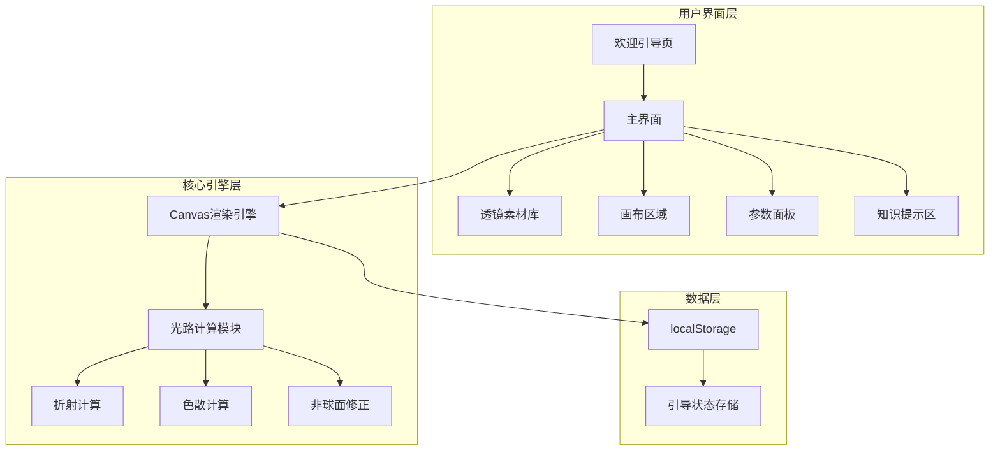
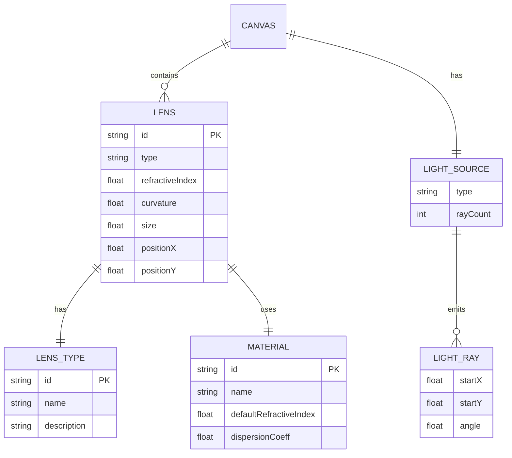
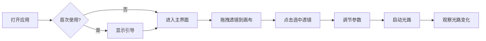

# 中学生交互式光学设计编程项目 - 设计文档

## 一、系统架构



## 二、模块关系图



## 三、核心功能模块

### 3.1 透镜类型与光路规律

| 类型 | 说明 | 光路规律 |
|------|------|----------|
| convex | 凸透镜 | 光线向光轴会聚 |
| concave | 凹透镜 | 光线向外发散 |
| plano | 平面透镜 | 不偏折 |
| aspheric | 非球面透镜 | 精准会聚，消除球差 |

### 3.2 材料类型

| 材料 | 折射率 | 色散系数 | 说明 |
|------|--------|---------|------|
| normal | 1.5 | 0.3 | 普通玻璃 |
| highIndex | 1.7 | 0.25 | 高折射率，更薄更强聚光 |
| lowDispersion | 1.52 | 0.1 | 低色散，减少彩虹光斑 |

## 四、UI/UX 规范

### 4.1 色彩体系

- 主色调: #4A90E2 (蓝色)
- 强调色: #5D7A3A (低饱和绿)
- 页面背景: #F5F2EB (浅米白)
- 卡片背景: #FFFFFF
- 主文本: #333333
- 次文本: #666666
- 成功色: #4A5D23
- 错误色: #783F27

### 4.2 字体规范

- 中文: 思源黑体 / 系统默认无衬线体
- 标题: 18-20px, 字重700
- 正文: 14-16px, 字重500
- 辅助文字: 12px, 字重400

### 4.3 间距规范

- 基础单位: 8px
- 小间距: 8px
- 中间距: 16px
- 大间距: 24px
- 卡片圆角: 8px

### 4.4 交互规范

- 可点击区域: ≥44px × 44px (移动端≥48px)
- 过渡动画: 0.3s ease
- 光路更新: 实时

## 五、响应式断点

| 设备 | 断点 | 布局 |
|------|------|------|
| 手机 | <768px | 纵向布局 |
| 平板 | 768px-1024px | 纵向布局 |
| 电脑 | >1024px | 横向布局 |

## 六、文件结构

```
frontend-user/
├── index.html          # 主入口
├── Dockerfile          # Docker配置（构建阶段校验题库清单）
├── data/
│   └── quiz-manifest.js   # 测验题库清单（题目/知识点/提示的唯一数据源）
├── css/
│   ├── reset.css       # 样式重置
│   ├── variables.css   # CSS变量
│   ├── layout.css      # 布局样式
│   ├── components.css  # 组件样式
│   └── responsive.css  # 响应式样式
├── js/
│   ├── app.js             # 应用入口
│   ├── config.js          # 配置常量
│   ├── storage.js         # 本地存储
│   ├── guide.js           # 引导系统
│   ├── canvas.js          # 画布管理
│   ├── renderer.js        # 光路渲染
│   ├── physics.js         # 物理计算
│   ├── interaction.js     # 交互处理
│   ├── quiz.js            # 测验管理器（从清单取题）
│   ├── quiz-validator.js  # 题库清单校验（浏览器/Node 共用）
│   └── utils.js           # 工具函数
└── tools/
    └── validate-quiz.js   # 清单校验 Node 入口（本地与容器构建共用）
```

## 七、测验题库清单维护

题目、知识点与答题提示集中在 `data/quiz-manifest.js` 维护，页面代码不包含任何题目数据，调整题目只需修改清单。

- 每道题必须标出：题型 `type`、难度 `difficulty`、考查内容 `knowledgePoints`（引用知识点 id）。
- 知识点必须填写 `observable`（该知识点在实验中能观察到的现象），答题验证后展示给学生。
- 校验逻辑在 `js/quiz-validator.js`，浏览器加载清单与容器构建（`tools/validate-quiz.js`）使用同一套规则；缺必填内容或引用不存在知识点的条目会给出说明并跳过，清单无有效题目时构建失败、测验模式不可用。

## 八、核心交互流程


## 九、光路计算原理

### 8.1 核心规律

- 凸透镜：光线向中间会聚（向光轴偏折）
- 凹透镜：光线向外发散（远离光轴）
- 平面透镜：不偏折
- 非球面：消除球差，边缘光线修正

### 8.2 偏折角度计算

```javascript
// 基础偏折强度
baseStrength = (refractiveIndex - 1) * curvature * 0.8

// 凸透镜：向光轴偏折
deflection = -relativePos * baseStrength

// 凹透镜：远离光轴
deflection = +relativePos * baseStrength

// 非球面：应用修正系数减少边缘球差
deflection = -relativePos * baseStrength * asphericCorrection
```

### 8.3 非球面修正

非球面透镜通过改变表面曲率补偿球差：
- 边缘曲率更平缓
- 减少边缘光线过度偏折
- 所有光线汇聚到同一焦点

### 8.4 色散模型

不同波长光的折射率不同（柯西公式简化）：
- 蓝光折射率最大，偏折最多
- 红光折射率最小，偏折最少
- 低色散镜片：三色光几乎重合
